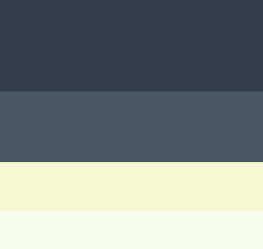

# 421

421 est une application produite grâce à android studio permettant de générer la feuilles de comptage d'une partie de 421 (jeu de dés)

## Activités

### MainActivity 
#### Description :
Page d'accueil de l'application, permet de lancer une nouvelle partie, sur validation envoie vers UserDefineActivity
#### Actions : 
- Instanciation de Game en variable globale
- startActivity : UserDefineActivity

#### Layout
- Title
- Button new game
- Copyright

===

### UserDefineActivity 
#### Description :
Page de sélection des joueurs participant. Après validation renvois vers ScoreActivity
#### Actions : 
- Appelle multiple de Game::addPlayer()
- startActivity : ScoreActivity

#### Layouts
- Title
- Fields & Label
- Validation

=== 

### ScoreActivity 
#### Description :
Page de sélection des scores. Marque le déroulement d'un tour classique. Cette page enregistre un score pour un joueur en prenant en compte selfSquall et coSquall (bourrasques).
Lors de la validation, le score est ajouté, le joueur suivant est changé et l'on relance l'activité. 

#### Actions : 
- Appelle de Game::getActualPlayer() -> Player player
- Traite Game::getCombinaisonsLib() sous forme de ArrayAdapter puis affichage dans GridView
- Listener GridView item -> Sauvegarde temporaire des score 
- Après validation : 
  - Appelle de player.addScore(args)
  - Appelle de Game::nextPlayer()
  - startActivity : ScoreActivity

#### Layout :
- Title
- Legend Player name
- Infos
  - selfSquall
  - coSquall
  - valueBase (valeur actuelle du score temporaire, il affiche la valeur et le libellé de la combinaison sélectionner après un clique sur un item de GridView) 
- Grid View
- Validation

===

### OverviewActivity
#### Description
Cette activité permet d'afficher l'état actuelle de la partie, elle est disposé sous forme d'une grille et s'affiche lorsque le jeu est en pause. Pour mettre le jeu en pause, un bouton est situé dans la navbar.
Cette activité est donc composer des scores réaliser depuis le début de la partie ainsi que d'autres informations tels que les selfSquall et coSquall présentent.

#### Layout
- Game.coSquall
- Grid view : Autant de colonnes que de players
  - Player.name
  - Player.scores
  - Player.nbWarned
  - Player.selfSquall

===

### PreferencesActivity
#### Description
Permettra de sélectionner des paramètre particulier, notamment la valeure ou l'existence de certaines combinaisons.
A voir à la fin du développement, elle est prise en compte par Android studio

===

## Menu principal
Il est constitué de plusieurs éléments renvoyant à des actions
- previous : supprime le dernier score, revient au joueur précédent, décrémente si besoins les bourrasques
- overview : lance l'activité OverviewActivity
- play : lance l'activité ScoreActivity si le jeu est en pause sinon le boutons est visible mais désactivé
- setting : lance l'activité PreferencesActivity
- warning : ouvre un menu listant les joueurs et permettant de les sanctionner

## Informations complémentaire 
#### Charte graphique : 

\#333c4a |  #495664  |  #f6f7d3   |   #f8fceb

## TO DO
- Définir des styles pour les éléments récurrents tels que les boutons, les titres d'activité, les labels simple, les layout de background
- Crée activité OverviewActivity
- Crée activité PreferencesActivity
- Créer l'actions previousShot() dans l'objet Game
- Créer le menu et ses composant
- Designer l'appli
- Intégré l'appli

